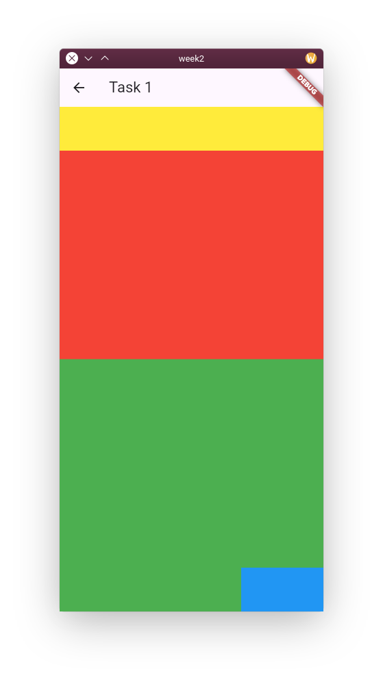
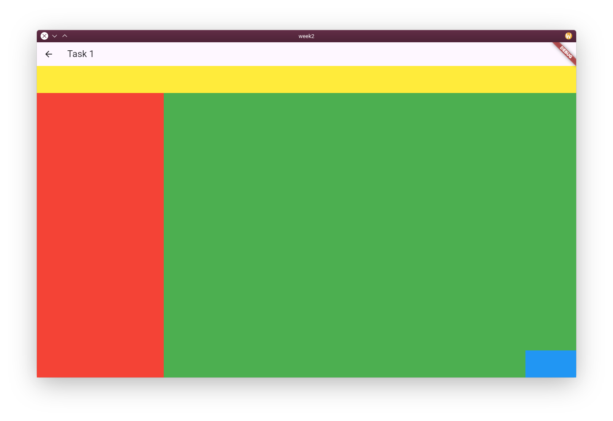
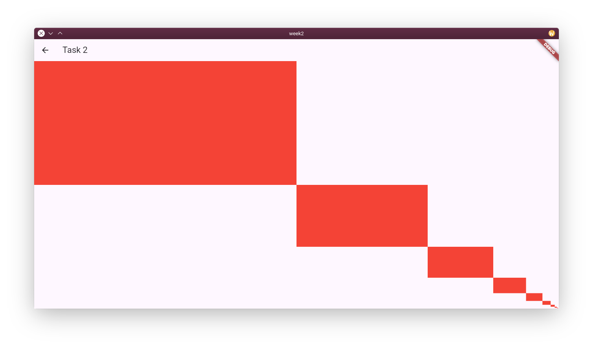

# Labs week 2 – constraints & layout

If your IDE doesn't detect the project files, run the following in the terminal:

```shell
cd labs/week2
flutter pub get
```

## Tasks

Your task is to recreate the following layouts:

### Task 1

| Narrow                               | Wide                             |
|--------------------------------------|----------------------------------|
|  |  |

The breakpoint between the two layouts is up to you – for example, at 600 px.

### Task2



***Do not use flex widgets (`Row` or `Column`) or stacks.***
